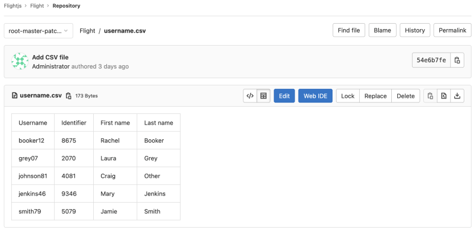

# CSV files

DETAILS:
**Tier:** Free, Premium, Ultimate
**Offering:** GitLab.com, Self-managed, GitLab Dedicated

> - [Introduced](https://gitlab.com/gitlab-org/gitlab/-/issues/14174) in GitLab 14.1.

A comma-separated values (CSV) file is a delimited text file that uses a comma to separate values.
Each line of the file is a data record. Each record consists of one or more fields, separated by
commas. The use of the comma as a field separator is the source of the name for this file format.
A CSV file typically stores tabular data (numbers and text) in plain text, in which case each line
has the same number of fields.

The CSV file format is not fully standardized. Other characters can be used as column delimiters.
Fields may or may not be surrounded to escape special characters.

When added to a repository, files with a `.csv` extension are rendered as a table when viewed in
GitLab.

